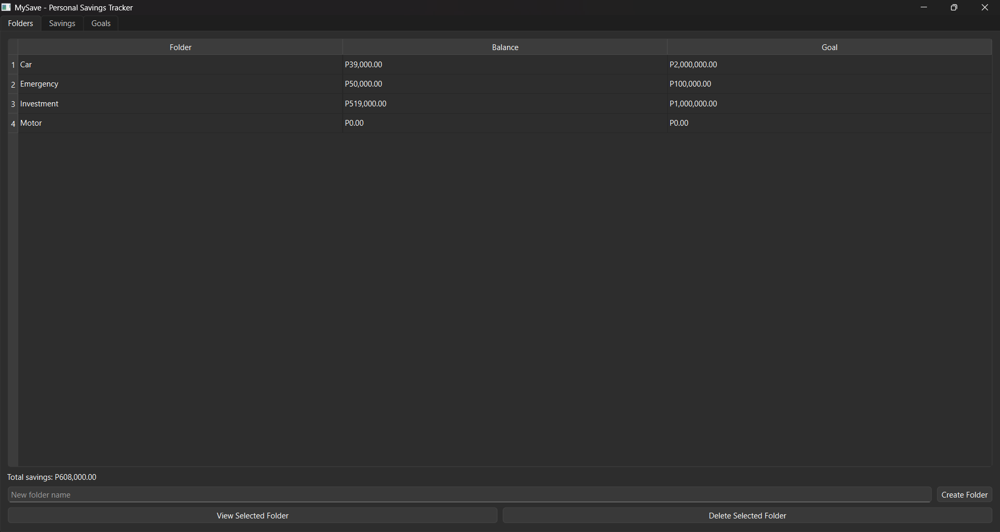
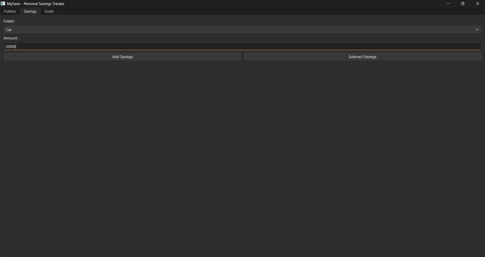
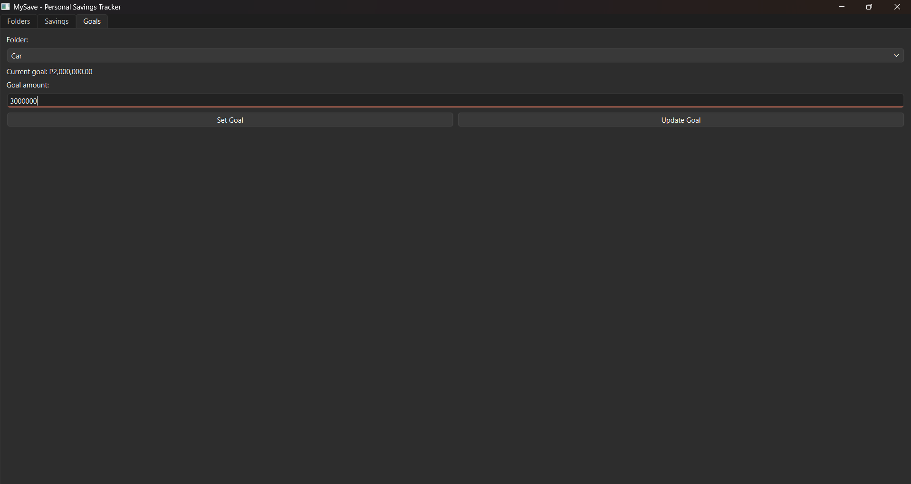

## 1. Project Title

**MySAVE: A Personal Savings Tracker**


## 2. Project Description

**What the System Does** 
MySAVE is a personal savings tracking system developed as a desktop GUI application. It allows users to encode and specifically separate their savings into different folders such as Emergency, Investment, or other personal goal. The system keeps track of the current balance and goal amount for each folder. It also records savings transactions in an SQLite database.

**Problem or Need Addressed** 
Managing savings manually like writing or putting it into the 'note' application on phones can make it difficult to keep track of different financial goals and current balances. Another problem with the traditional way of noting your savings on a sheet of paper is that papers are very vulnerable (very easy to tear apart or to be crumpled / can be thrown anytime without being noticed). Additionally, this project is already a feature of a e-wallet app, however, the problem about this is e-wallet is accessible anytime and anywhere (if you have an internet), which put your savings into danger if for instance, you need money on that time. MySAVE provides a simple way to organize savings and monitor progress in one application. This helps people to track their saving funds and keeps them motivated when seeing their progress over time.


## 3. Project Objectives

The main objectives of MySAVE are:

- To provide a simple system for managing personal savings.
- To allow users to create and manage different savings folders.
- To record deposits and withdrawals.
- To set and update saving goals.
- To automatically calculate and display the total savings.
- To store savings information using a database.
- To demonstrate Object-Oriented Programming and CRUD/database concepts.


## 4. Features

**Savings Folder Management**
- Create a new savings folder.
- View all existing savings folders.
- View the balance of a selected folder.
- Delete a folder when its balance is zero.
- Display the current balance and goal of each folder.
- Display the total savings from all folders.

**Savings Management**
- Select a savings folder.
- Add/deposit money into a folder.
- Subtract/withdraw money from a folder.
- Prevent withdrawals that are greater than the current balance.
- Validate that the entered amount is a valid positive number.

**Goal Management**
- Select a savings folder.
- Set a savings goal.
- Update an existing savings goal.
- Display the current goal of the selected folder.


## 5. Technologies Used

**Programming Language**
- Python 3.14.7

**GUI Framework**
- PyQt6

**Database**
- SQLite3

**Other Libraries / Tools**
- `sqlite3` 
- `pathlib` 
- `dataclasses`
- `math` 
- `sys` 
- Visual Studio Code
- Git/Github
- Python virtual environment


## 6. Project Structure

```text
mySAVE/
│
├── main.py
│
├── database/
│   ├── database.py
│   └── savings.db
│
└── features/
    ├── helpers.py
    │
    ├── SavingsFolderManagement/
    │   ├── model.py
    │   ├── repository.py
    │   ├── service.py
    │   └── view.py
    │
    ├── SavingsManagement/
    │   ├── model.py
    │   ├── repository.py
    │   ├── service.py
    │   └── view.py
    │
    └── GoalManagement/
        ├── model.py
        ├── repository.py
        ├── service.py
        └── view.py
```


### Important Files and Folders

| File/Folder | Purpose |
|---|---|
| `main.py` | Starts the application and creates the main window and tabs. |
| `database/database.py` | Creates the SQLite connection and database tables. |
| `database/savings.db` | SQLite database containing the saved application data. |
| `features/helpers.py` | Contains helper functions such as amount/input validation. |
| `SavingsFolderManagement/model.py` | Defines the savings folder data model. |
| `SavingsFolderManagement/repository.py` | Handles database operations for savings folders. |
| `SavingsFolderManagement/service.py` | Contains the business logic for savings folders. |
| `SavingsFolderManagement/view.py` | Provides the GUI for creating, viewing, and deleting folders. |
| `SavingsManagement/model.py` | Defines the savings transaction model. |
| `SavingsManagement/repository.py` | Handles savings transaction database operations. |
| `SavingsManagement/service.py` | Handles deposit and withdrawal logic. |
| `SavingsManagement/view.py` | Provides the GUI for adding and subtracting savings. |
| `GoalManagement/model.py` | Defines the savings goal model. |
| `GoalManagement/repository.py` | Handles database operations for goals. |
| `GoalManagement/service.py` | Handles setting and updating savings goals. |
| `GoalManagement/view.py` | Provides the GUI for managing goals. |


## 7. Installation and Setup

**Requirements**
- Python 3.14.7
- PyQt6
- Visual Studio Code or another Python IDE

**Step 1: Clone the Repository**
Open a terminal and run:
```bash
git clone https://github.com/Jsupp-org/mySAVE.git
```
Then enter the project folder:
```bash
cd mySAVE
```

**Step 2: Open the Project**
Open the `mySAVE` folder in Visual Studio Code.

**Step 3: Create a Virtual Environment**
Open the VS Code terminal and run:
```bash
python -m venv .venv
```
Activate the virtual environment on Windows:
```bash
.venv\Scripts\activate
```

**Step 4: Install PyQt6**
Run:
```bash
pip install PyQt6
```

**Step 5: Run the Application**
Make sure the terminal is inside the project folder, then run:
```bash
python main.py
```

   
## 8. How to Use the System

**A. Create a Savings Folder**

1. Open the `Folders` tab.
2. Enter a folder name in the `New folder name` field.
3. Click `Create Folder`.
4. The new folder will appear in the table.

**B. View a Folder**

1. Go to the `Folders` tab.
2. Select a folder from the table.
3. Click `View Selected Folder`.
4. The application displays the folder's current balance.

**C. Add Savings**

1. Open the `Savings` tab.
2. Select a folder.
3. Enter the amount.
4. Click `Add Savings`.
5. The folder's current balance will increase.

**D. Subtract Savings**

1. Open the *`Savings` tab.
2. Select a folder.
3. Enter the amount.
4. Click `Subtract Savings`.
5. The amount will be removed from the folder if sufficient balance is available. (The system prevents the user from withdrawing more money than the folder contains.)

**E. Set a Goal**

1. Open the `Goals` tab.
2. Select a folder.
3. Enter the target amount.
4. Click `Set Goal`.

**F. Update a Goal**

1. Open the `Goals` tab.
2. Select a folder that already has a goal.
3. Enter the new target amount.
4. Click `Update Goal`.


## 9. OOP Implementation

MySAVE uses Object-Oriented Programming throughout the application.

**Important Classes**

- `Database`
- `SavingsFolderModel`
- `SavingsFolderRepository`
- `SavingsFolderService`
- `SavingsFolderView`
- `SavingsModel`
- `SavingsRepository`
- `SavingsService`  
- `SavingsView`
- `GoalModel`
- `GoalRepository`
- `GoalService`
- `GoalView`
- `Main`

**Encapsulation**

Encapsulation is applied by organizing data and related operations inside classes.

For example, `SavingsFolderService` handles the operations related to savings folders, while `SavingsFolderRepository` handles the database operations.

The views also communicate with service classes instead of directly performing all database operations.

**Inheritance**

PyQt6 classes are inherited to create the application's GUI components.

Examples:

```python
class MainWindow(QMainWindow):
```

and

```python
class SavingsView(QWidget):
```

The custom classes inherit functionality from PyQt6's `QMainWindow` and `QWidget`.

**Polymorphism**

The project does not use a large custom inheritance hierarchy requiring explicit method overriding. However, the GUI classes use PyQt6's inherited widget behavior and Qt's signal/slot system to respond to user actions.


## 10. Database

**Database Structure**

The system uses an SQLite database named:

`database/savings.db`

It contains two main tables:

1. `savings_folders`
2. `savings_transac`

**`savings_folders` Table**

```text
id
name
goal_amount
current_amount
create_at
```
Purpose:
- Stores each savings folder.
- Stores the savings goal.
- Stores the current balance.

**`savings_transac` Table**

```text
id
folder_id
transaction_type
amount
note
create_at
```
Purpose:
- Stores deposits and withdrawals.
- Connects each transaction to a savings folder through `folder_id`.

**Relationship**

The relationship can be represented as:

```text
savings_folders
      |
      | 1
      |
      | many
      v
savings_transac
```
One savings folder can have many savings transactions.

The `folder_id` column in `savings_transac` is a foreign key referencing the `id` column in `savings_folders`.

**CRUD Operations**

*Create*
The system can create a new savings folder using:
```sql
INSERT INTO savings_folders
```

Savings transactions are also created using:
```sql
INSERT INTO savings_transac
```

*Read*
The system reads folders using queries such as:
```sql
SELECT id, name, goal_amount, current_amount
FROM savings_folders
```

*Update*
The system updates:
- Current savings balance after deposits or withdrawals.
- Savings goals when setting or updating a goal.

Example:
```sql
UPDATE savings_folders
SET goal_amount = ?
WHERE id = ?
```

*Delete*
The system can delete a savings folder:
```sql
DELETE FROM savings_folders
WHERE id = ?
```
The application only allows deletion when the folder balance is zero.

*Search / Find*
The application finds a folder by its name:
```sql
SELECT id, current_amount
FROM savings_folders
WHERE name = ?
```


## 11. Screenshots

**Screenshots**

*Folders Tab*
    Shows the list of savings folders, balances, goals, and total savings.




*Savings Tab*   
    Shows the controls for adding and subtracting savings.




*Goals Tab*
    Shows the controls for setting and updating savings goals.




## 12. Testing

The system was tested using different inputs to check its major features and validation rules.
----------------------------------------------------------------------------------------------------------------------------------------------
|                Test             |               Input / Action              |                       Expected Result                        |
|---------------------------------|-------------------------------------------|--------------------------------------------------------------|
| Create folder                   |   Create `Emergency`                      |    Folder is created and displayed.                          |
| Duplicate folder                |   Create another `Emergency`              |    System displays an error because the name already exists. |
| Empty folder name               |   Leave the folder name empty             |    System displays an error.                                 |
| Add savings                     |   Add `2000` to a folder                  |    Balance increases by `P2,000.00`.                         |
| Withdraw savings                |   Withdraw `500`                          |    Balance decreases by `P500.00`.                           |
| Excess withdrawal               |   Withdraw more than the current balance  |    System displays an insufficient balance error.            |
| Invalid amount                  |   Enter text such as `abc`                |    System displays an invalid input error.                   |
| Negative amount                 |   Enter a negative amount                 |    System rejects the transaction.                           |
| Set goal                        |   Set a goal such as `100000`             |    Goal is saved for the selected folder.                    |
| Update goal                     |   Change an existing goal                 |    Goal is updated.                                          |
| Delete folder with zero balance |   Delete a folder with `P0.00`            |    Folder is deleted.                                        |
| Delete folder with balance      |   Delete a folder containing savings      |    System prevents deletion.                                 |
| Total savings                   |   Create/update several folders           |    Total savings is recalculated and displayed.              |
----------------------------------------------------------------------------------------------------------------------------------------------
**Example Database Test**

A sample database state can contain folders such as:

Car
Motor
Emergency
Investment

Each folder stores its own goal and current balance, while deposits and withdrawals are stored in the transaction table.


## 13. Known Issues / Limitations

- The application is currently designed as a local desktop application.
- It does not have user accounts or login functionality.
- There is no online/cloud synchronization.
- Savings transactions are stored in the database, but there is currently no GUI screen for viewing a complete transaction history.
- The transaction `note` field exists in the database but is not currently exposed through the GUI.
- The application does not provide charts or graphs for savings progress.
- The application does not automatically calculate a recommended amount to save per day or month.
- The system uses a simple folder-name search rather than a separate search screen.
- The database is stored locally on the computer.


## 14. Author

**Name:** Jasper B. Indil

**Section:** 3581
